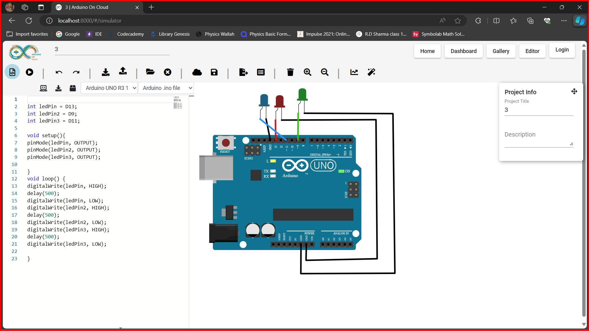

# TASK5 : Approach to Auto generate .ino code 

We are creating a "Generate Code" button to generate the code for the components which are connected with Arduino, generating code automatically will require us to check the connections everytime there is a change in circuit which will slow down the ciecuit creation, Hence i am providing a button to generate the code manually whenever it is required.

Since, every component has its own arduino code i have defined the logic for  LED in [LED.ts]() file similarly we can do it for other components.The [code-editor.component.ts]() contains the logic for the code editor and respective buttons like "Download ino code" because of that I have also included the logic to generate the code in this file.

When we click on 'Generate code' button we iterate over all the circuit components and check if the component has method to generate the code.
After recieving the generated code from respective component, the code gets formatted.

In each component we will define a  `` generateCode`` method which will contain the logic to create the Arduino code of that particular component and we have to check the connections with Arduino.We will be using BFS(Breadth First Search) for finding these connections.

Since,if a component is connected to breadboard we need to find the correct node which is connected with the component and Arduino. I have written the logic to find the nodes that are connected together in a breadboard in [General.ts]() as it contains BreadBoard class.

## Screenshots

## Demo

https://youtu.be/kuwYyv6_WGY

<iframe width="560" height="315" src="https://youtu.be/kuwYyv6_WGY" frameborder="0" allowfullscreen></iframe>